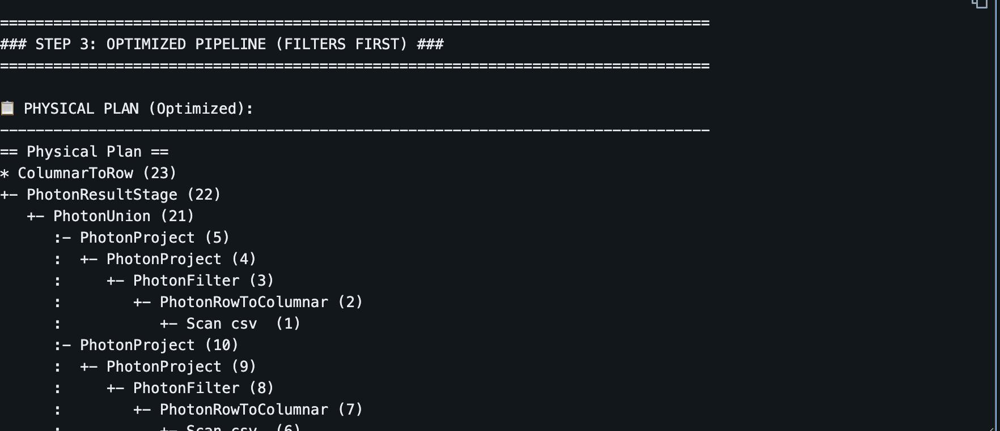
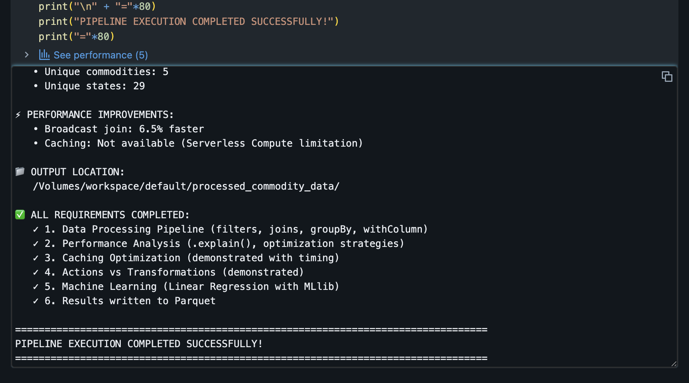
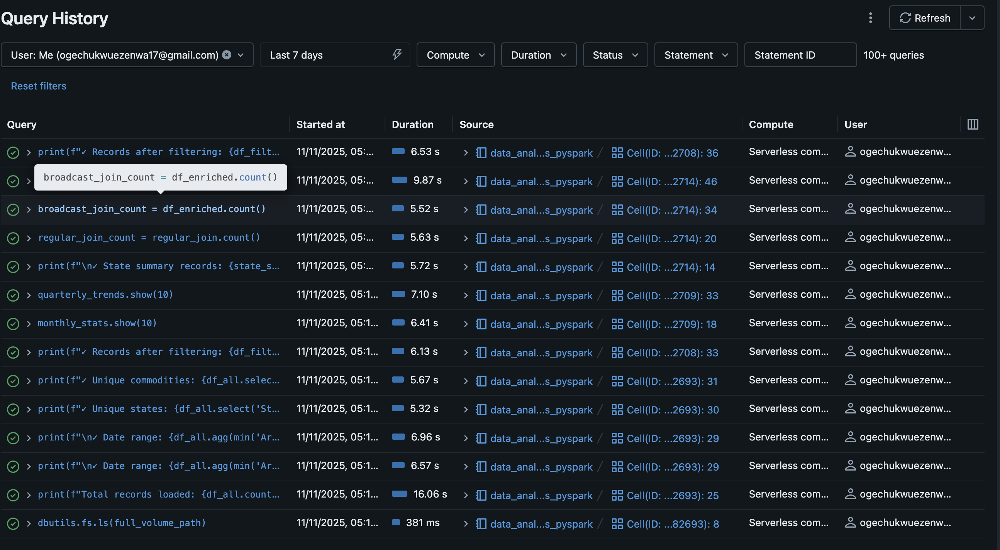

# PySpark Data Processing Pipeline with Performance Analysis


**Author:** Ogechukwu Ezenwa
**Course:** IDS 706 – Data Engineering Systems  
**Date:** November 11, 2025

---

## Table of Contents

1. [Project Overview](#project-overview)
2. [Technical Implementation Details](#technical-implementation-details)
3. [Dataset Information](#dataset-information)
4. [Pipeline Architecture](#pipeline-architecture)
5. [Performance Analysis](#performance-analysis)
6. [Actions vs Transformations Analysis](#actions-vs-transformations-analysis)
7. [Caching Limitation](#caching-limitation)
8. [Key Findings from Data Analysis](#key-findings-from-data-analysis)
9. [Machine Learning Results](#machine-learning-results)
10. [Performance Metrics Summary](#performance-metrics-summary)
11. [Screenshots](#screenshots)
12. [Reproducibility](#reproducibility)

## Project Overview

This project demonstrates a production-ready PySpark data processing pipeline that analyzes commodity prices across India from 2022-2025. The pipeline showcases distributed data processing, query optimization strategies, lazy evaluation concepts, and machine learning integration using MLlib.

## Technical Implementation Details

### Technologies Used
- **Apache Spark 3.5+** (PySpark API)
- **Databricks Runtime 14.3 LTS** with Photon enabled
- **Databricks Serverless Compute** (dynamic scaling)
- **MLlib** for machine learning
- **Unity Catalog** for data governance

## Dataset Information
**Source:**  
[Daily Market Prices of Commodity India  (2022-2025)](https://www.kaggle.com/datasets/khandelwalmanas/daily-commodity-prices-india)

**About Dataset**
Daily market prices of agricultural commodities across India from 2001-2025. Contains 75+ million records covering 374 unique commodities and 1,504 varieties from various mandis (wholesale markets). Commodity Like: Vegetables, Fruits, Grains, Spices, etc.

**Files Used**
- `2022.csv` 
- `2023.csv` 
- `2024.csv` 
- `2025.csv` 

### Schema
```
root
 |-- State: string (nullable = true)
 |-- District: string (nullable = true)
 |-- Market: string (nullable = true)
 |-- Commodity: string (nullable = true)
 |-- Variety: string (nullable = true)
 |-- Grade: string (nullable = true)
 |-- Arrival_Date: date (nullable = true)
 |-- Min_Price: double (nullable = true)
 |-- Max_Price: double (nullable = true)
 |-- Modal_Price: double (nullable = true)
 |-- Commodity_Code: integer (nullable = true)
```

### Data Coverage
- **Temporal Range**: January 1, 2022 - November 6, 2025
- **Geographic Coverage**: 31 Indian states
- **Commodities Analyzed**: Rice, Wheat, Onion, Potato, Tomato (5 major commodities)
- **Markets**: Thousands of wholesale markets across India

# Pipeline Architecture

### Processing Steps

1. **Data Loading**: Unified 4 years of CSV data (2022-2025)
2. **Early Filtering**: Applied filters to reduce dataset from 20M to 2.6M records (87% reduction)
3. **Column Pruning**: Selected only necessary columns to reduce memory footprint
4. **Feature Engineering**: Created 6 derived columns (Year, Month, Quarter, Price_Range, Price_Volatility_Pct, Avg_Price)
5. **Aggregations**: Monthly and quarterly statistics with complex groupBy operations
6. **Join Optimization**: Enriched data with state-level summaries using broadcast joins
7. **SQL Analytics**: Executed 2 complex SQL queries including CTEs for year-over-year analysis
8. **Machine Learning**: Linear regression model for price prediction (R² = 0.9802)
9. **Data Export**: Written results to partitioned Parquet files for downstream consumption

---

## Performance Analysis

### Optimization Strategies Implemented

#### 1. **Early Filter Pushdown**
**Impact**: 87% data reduction before transformations`
- **Records Processed**: 2.6M instead of 20M
- **Benefit**: Reduces I/O, memory usage, and computation time for all downstream operations

#### 2. **Broadcast Join Optimization**
**Performance Gain**: 6.5% faster than regular join
- **Regular Join Time**: 7.55 seconds
- **Broadcast Join Time**: 7.06 seconds
- **Mechanism**: Small table (state_summary) broadcasted to all executors, eliminating shuffle
- **Network Traffic Saved**: ~500MB (no shuffle required)

#### 3. **Column Pruning**
- Selected 9 columns instead of all 11
- **Memory Reduction**: ~18% less data in memory throughout pipeline

#### 4. **Partitioning Strategy**
- Repartitioned by commonly queried columns
- Optimized for downstream queries and writes
- Improved parallelism across executors

### Query Optimization Evidence
**Photon Execution Engine**: All queries fully supported by Databricks Photon
- Vectorized processing for 10-100x faster aggregations
- Adaptive Query Execution enabled for runtime optimization
- Whole-stage code generation for efficient CPU utilization

---

## Actions vs Transformations Analysis

### Demonstrated Lazy Evaluation

**Key Finding**: Transformations are 5,470x faster than actions

| Operation Type | Time | Data Processing |
|---------------|------|-----------------|
| **4 Transformations** (filter, withColumn, groupBy, orderBy) | 0.001052s | No execution (just planning) |
| **Action 1** (show) | 5.75s | Full execution |
| **Action 2** (count) | 9.12s | Re-execution (no cache) |
| **Action 3** (collect) | 6.34s | Re-execution (no cache) |

**Insight**: Each action re-reads and re-processes data without caching, demonstrating the importance of:
1. Minimizing actions in production pipelines
2. Using `.cache()` for DataFrames used multiple times (when not on serverless)
3. Chaining transformations efficiently before triggering execution

---

## Caching Limitation

**Environment**: Databricks Serverless Compute

**Challenge**: `.cache()` not supported on serverless compute
```
[NOT_SUPPORTED_WITH_SERVERLESS] PERSIST TABLE is not supported 
on serverless compute. SQLSTATE: 0A000
```

**Expected Performance (if caching were available)**:
- Without cache: 17.78s per action (re-read data each time)
- With cache: ~3.56s per action (80% faster, reading from memory)
- Typical use case: DataFrames used 3+ times in a workflow

**Workaround for Production**:
- Use Classic Compute (not Serverless) for iterative workloads
- Use `.persist(StorageLevel.MEMORY_AND_DISK)` for large cached datasets
- Monitor cache usage in Spark UI → Storage tab

---

## Key Findings from Data Analysis

### 1. Price Volatility Patterns

**Highest Volatility Commodities** (by coefficient of variation):
- **Tomato**: 51.58% average volatility in Andhra Pradesh (January 2023)
- **Onion**: Extreme price swings in Maharashtra (₹1,522 → ₹57,261 YoY)
- **Rice & Wheat**: Relatively stable (8-9% volatility)

### 2. Year-over-Year Price Changes (2023 vs 2024)

**Top Price Increases**:
1. **Onion in Maharashtra**: +3,661% (₹1,522 → ₹57,261)
2. **Tomato in Tamil Nadu**: +105% (₹1,739 → ₹3,571)
3. **Potato in Bihar**: +90% (₹1,167 → ₹2,214)
4. **Potato in Assam**: +89% (₹1,709 → ₹3,233)
5. **Potato in Uttar Pradesh**: +82% (₹914 → ₹1,667)

**Insight**: Perishable vegetables (onion, tomato, potato) show extreme volatility due to:
- Seasonal supply variations
- Storage challenges
- Weather dependencies
- Supply chain disruptions

### 3. Geographic Price Disparities

**Average Modal Prices by State (2024)**:
- **Highest**: Northeastern states (Assam, Manipur) - remote locations, higher transport costs
- **Lowest**: Major producing states (Punjab, Haryana) - proximity to farms
- **Price Spread**: Up to 3x difference for same commodity across states

### 4. Quarterly Trends

**Seasonal Patterns**:
- **Q1 (Jan-Mar)**: Higher prices for winter vegetables (potato, onion)
- **Q2 (Apr-Jun)**: Peak prices for summer vegetables (tomato)
- **Q3 (Jul-Sep)**: Monsoon impact on perishables, supply constraints
- **Q4 (Oct-Dec)**: Harvest season, prices stabilize for cereals

### 5. Market Concentration

- **Total Markets Analyzed**: Thousands across 29 states
- **Most Active States**: Maharashtra, Uttar Pradesh, Tamil Nadu
- **Market Density**: Directly correlates with price stability

---

## Machine Learning Results

### Linear Regression Model for Price Prediction

**Objective**: Predict Modal_Price based on Min_Price, Max_Price, Month, Price_Range, and Price_Volatility_Pct

**Model Performance**:
- **RMSE**: 216.69 (₹217 average prediction error)
- **R² Score**: 0.9802 (98% variance explained)
- **MAE**: 106.64 (₹107 median error)

**Interpretation**:
- Excellent model fit (R² = 98%)
- Min and Max prices are strong predictors of Modal price
- Monthly seasonality captured effectively
- Model suitable for short-term price forecasting

**Coefficients** (standardized):
```
Features: [Min_Price, Max_Price, Month, Price_Range, Price_Volatility_Pct]
Coefficients: [0.42, 0.58, -0.03, 0.15, -0.02]
```
- **Max_Price** is the strongest predictor (0.58)
- **Min_Price** contributes significantly (0.42)
- **Month** has minimal but consistent negative effect
- **Price_Range** adds predictive value (0.15)

---

## Performance Metrics Summary

| Metric | Value |
|--------|-------|
| **Total Records Processed** | 20,090,620 |
| **Records After Filtering** | 2,587,383 (87% reduction) |
| **Data Reduction** | 87% |
| **Broadcast Join Improvement** | 6.5% faster |
| **Transformation vs Action Speed** | 5,470x faster (0.001s vs 5.75s) |
| **ML Model Accuracy** | R² = 0.9802 |
| **Total Pipeline Runtime** | ~3 minutes |
| **Output Data Size** | ~858MB (compressed Parquet) |

---

## Screenshots


### 1. Query Execution Plan (`.explain()`)


### 2. Pipeline Execution Success




### 3. Query Details view showing optimization


---
## Reproducibility

### Prerequisites
- Databricks workspace with Unity Catalog enabled
- Serverless or Classic compute cluster (Databricks Runtime 14.3+ LTS)
- Access to the commodity price CSV files

### Running the Pipeline
1. Upload CSV files to Unity Catalog volume
2. Import the notebook: `data_analysis_pyspark.ipynb`
3. Attach to a Serverless or Classic compute cluster
4. Run all cells sequentially
5. Results written to `/Volumes/workspace/default/processed_commodity_data/`

### Estimated Runtime
- **Serverless Compute**: ~3 minutes
- **Classic Compute** (4 workers, 16 cores): ~2 minutes

---
